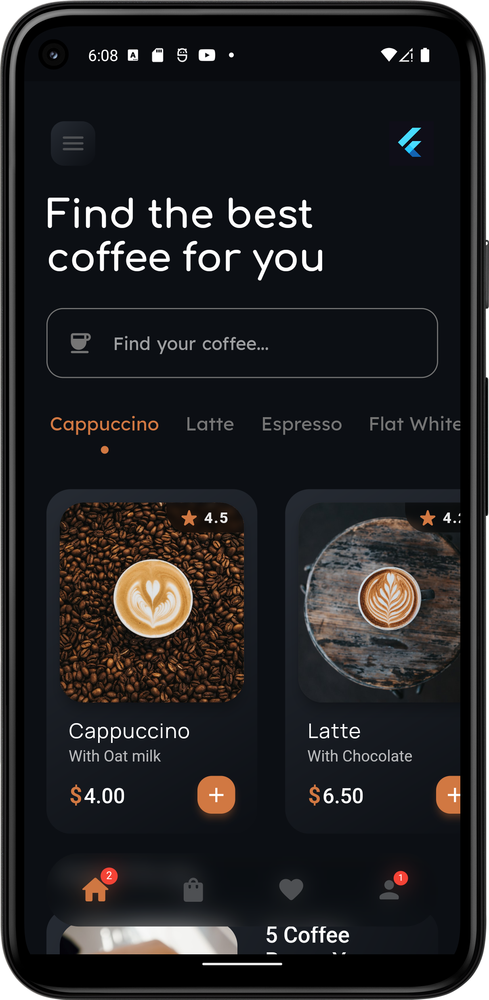
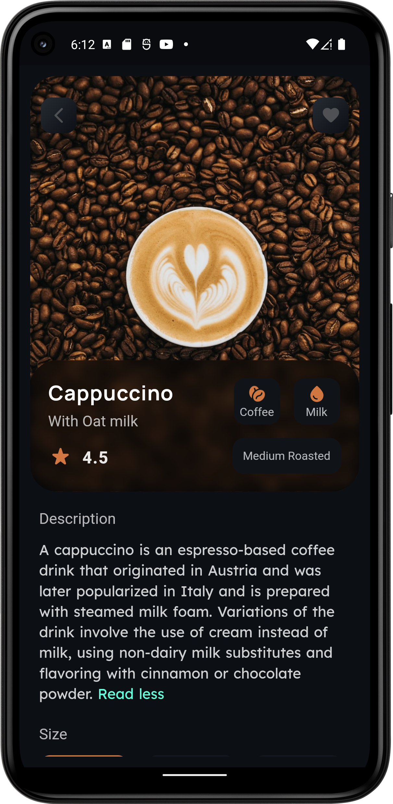
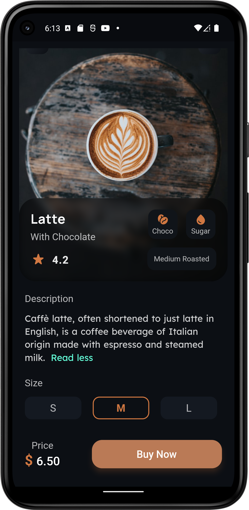
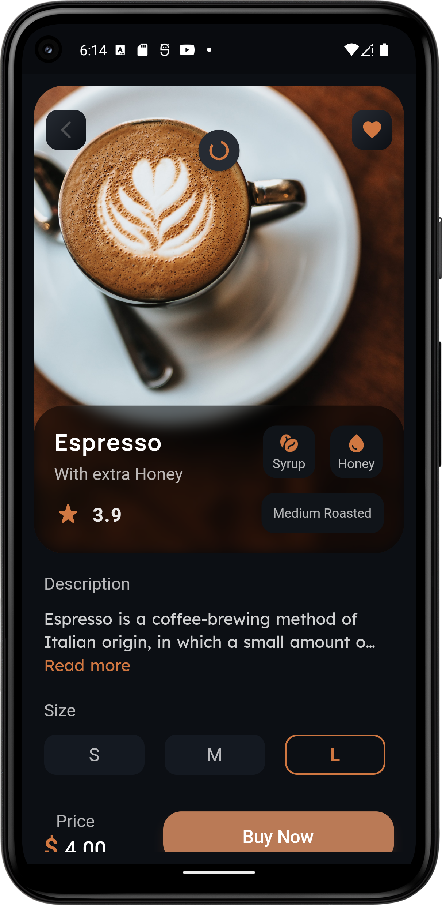

# Coffee App UI ☕

Improving my UI development skills with flutter

## Download
#### For [Android devices](https://drive.google.com/file/d/1hjN7cLROGusrJRzmv-AQG_6EqUQFbyvp/view?usp=sharing) only

## Preview
https://user-images.githubusercontent.com/67847070/207144493-61ff7f30-e4db-4f70-9844-ea79249284dc.mp4

## The UI design

## Screenshots
### Home Screen

### Item Screen1

### Item Screen2

### Item Screen3

